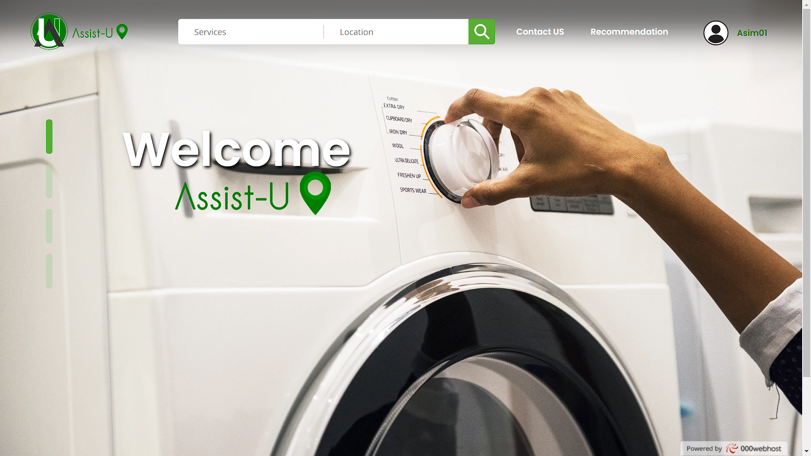
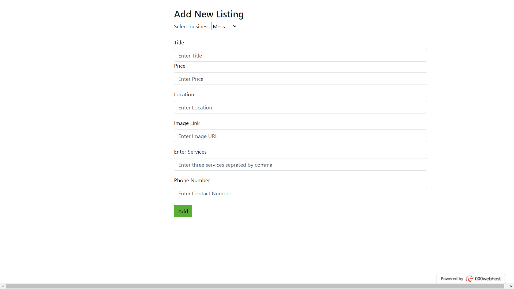
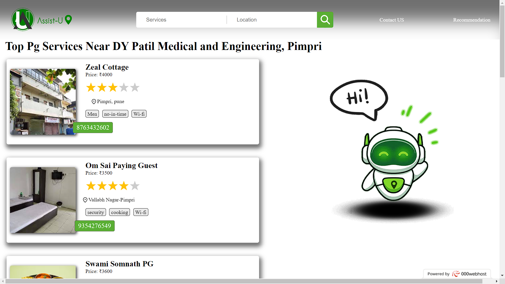
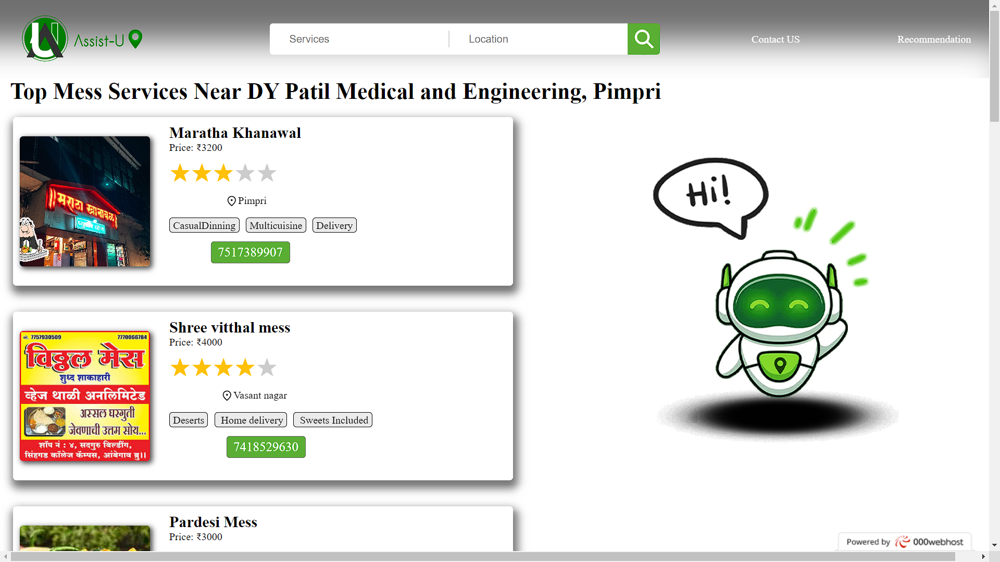

# <h1>AssistU : Student Services Listing and Recommendation</h1>

A web platform enabling college students to discover essential services, including Food/Mess, PG/hostels, Medi-clinics, and Laundry, located near their campus. This dynamic application offers a user-friendly interface with a recommendation system based on user ratings.

---

## <h2>Features</h2>
- **Service Listings**: Enables students to find nearby services like food, PGs, clinics, and laundry.
- **User & Admin Functions**: User login system with a separate admin panel to manage listings.
- **Recommendation System**: Integrated star rating and recommendation system using PHP to display highly-rated services.
- **Responsive Design**: Ensures seamless navigation on multiple devices for a better user experience.

## <h2>Technologies Used</h2>
- **Frontend**: HTML, CSS, JavaScript for design and responsiveness.
- **Backend**: PHP for logic and recommendations.
- **Database**: MySQL (or your preferred database) for storing user and service information.

---

## <h2>Screenshots</h2>

  
*Description: The main homepage displaying categories of essential services for easy access.*

  
*Description: Admin panel for managing service listings and monitoring user feedback.*


 
*Description: The star rating and recommendation feature showing top-rated services.*

---

## <h2>How to Use</h2>
1. **Explore Services**: Browse essential services by category and location.
2. **User Account**: Log in to rate services and receive personalized recommendations.
3. **Admin Functions**: Access the admin panel (for admins only) to manage and update listings.

---

## <h2>Installation</h2>
1. Clone the repository:
   ```bash
   git clone https://github.com/your-username/College_Campus_Services_Finder.git
   cd College_Campus_Services_Finder
